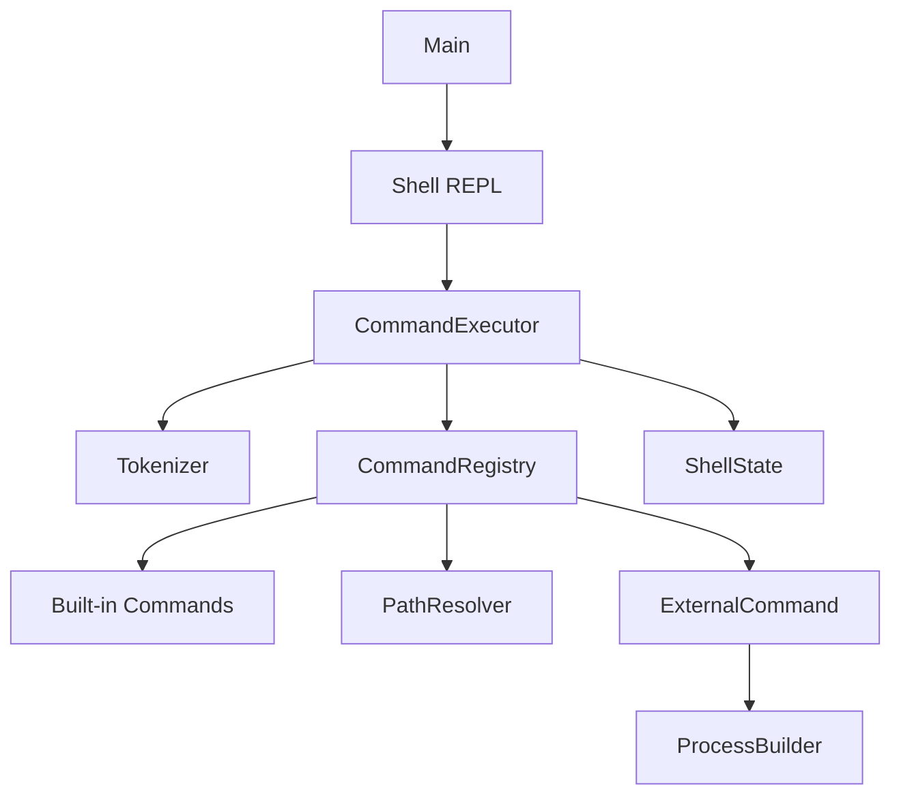

# Build Your Own Shell (BYOS) — Java

[](https://app.codecrafters.io/courses/shell/overview)
[](https://openjdk.org/)
[](LICENSE)

A **POSIX-style interactive shell** built in **core Java** for the [CodeCrafters Build Your Own Shell](https://app.codecrafters.io/courses/shell/overview) challenge. The implementation uses the **Command Executor pattern** with clean separation between parsing, resolution, and execution.

---

## Table of Contents

- [Overview](#overview)
- [Features](#features)
- [Architecture](#architecture)
- [Design Patterns](#design-patterns)
- [Project Structure](#project-structure)
- [Development Timeline](#development-timeline)
- [Getting Started](#getting-started)
- [Usage Examples](#usage-examples)
- [How It Works](#how-it-works)
- [Submitting to CodeCrafters](#submitting-to-codecrafters)
- [Future Extensions](#future-extensions)

---

## Overview

This shell reads user input in a REPL loop, tokenizes commands, resolves them against built-ins or `$PATH`, and executes them. Built-in commands run in-process; external programs are spawned via `ProcessBuilder` with inherited I/O and the shell's working directory.

**Tech stack:** Core Java 21 · Maven · No frameworks

---

## Features

| Feature | Status | Description |
|---------|--------|-------------|
| Interactive prompt | ✅ | Prints `$ ` and waits for input |
| REPL loop | ✅ | Continuous read-eval-print until `exit` or EOF |
| Invalid command handling | ✅ | `command: command not found` |
| `echo` | ✅ | Prints arguments joined by spaces |
| `exit` | ✅ | Terminates the shell cleanly |
| `type` | ✅ | Reports built-in, PATH location, or not found |
| `pwd` | ✅ | Prints current working directory |
| `cd` | ✅ | Absolute, relative, `~`, and no-arg (HOME) paths |
| External programs | ✅ | Executes binaries found in `$PATH` |
| Quote-aware tokenizer | ✅ | Single quotes, double quotes, backslash escaping |

---

## Architecture



### Request flow

1. **Shell** prints `$ ` and reads a line from stdin.
2. **Tokenizer** splits the line into command name + arguments (respecting quotes).
3. **CommandRegistry** resolves the command — built-ins first, then `$PATH`.
4. **Command** executes with shared **ShellState** (cwd + environment).
5. Loop continues unless `exit` is issued or stdin closes.


---

## Design Patterns

| Pattern | Where | Purpose |
|---------|-------|---------|
| **Command** | `Command` interface | Encapsulates each shell operation as an object |
| **Command Executor** | `CommandExecutor` | Central dispatcher: parse → resolve → execute |
| **Registry** | `CommandRegistry` | Maps command names to handler instances |
| **Template Method** | `BuiltinCommand` | Shared contract for all built-in commands |
| **Strategy** | `ExternalCommand` | Pluggable execution for external processes |

---

## Project Structure

```
src/main/java/
├── Main.java                    # Entry point
├── shell/
│   ├── Shell.java               # REPL loop
│   └── ShellState.java          # Shared cwd + environment
├── core/
│   ├── CommandExecutor.java     # Parse → resolve → execute
│   ├── CommandRegistry.java     # Built-in + external lookup
│   └── PathResolver.java        # $PATH search (cached at startup)
├── commands/
│   ├── Command.java             # Command interface
│   ├── BuiltinCommand.java      # Abstract base for built-ins
│   ├── EchoCommand.java
│   ├── ExitCommand.java
│   ├── TypeCommand.java
│   ├── PwdCommand.java
│   ├── CdCommand.java
│   └── ExternalCommand.java     # ProcessBuilder execution
└── utils/
    └── Tokenizer.java           # Quote-aware input parser
```

---

## Development Timeline

A day-by-day build plan for the August 2026 sprint — each stage maps to a CodeCrafters milestone.

| Day | Date | Milestone | What was built |
|-----|------|-----------|----------------|
| 1 | Aug 1 | Print a prompt | `$ ` prompt + program bootstrap |
| 2 | Aug 2 | Invalid commands | `xyz: command not found` error handling |
| 3 | Aug 3 | REPL | Continuous read loop with `BufferedReader` |
| 4 | Aug 4 | `exit` | `ExitCommand` + loop termination |
| 5 | Aug 5 | `echo` | `EchoCommand` + argument joining |
| 6 | Aug 6 | `type` (built-ins) | `TypeCommand` + `CommandRegistry` |
| 7 | Aug 7 | `type` (external) | `PathResolver` + PATH lookup |
| 8 | Aug 8 | Run a program | `ExternalCommand` + `ProcessBuilder` |
| 9 | Aug 9 | `pwd` | `ShellState` + `PwdCommand` |
| 10 | Aug 10 | `cd` (absolute) | `CdCommand` with path normalization |
| 11 | Aug 11 | `cd` (relative) | Resolve paths against cwd |
| 12 | Aug 12 | `cd` (home) | `~` expansion + bare `cd` → `$HOME` |
| 13 | Aug 13 | Tokenizer | Quote-aware parsing in `Tokenizer` |
| 14 | Aug 14 | Command Executor | `CommandExecutor` dispatcher |
| 15 | Aug 15 | Shell refactor | `Shell` class + REPL extraction |
| 16 | Aug 16 | BuiltinCommand base | Abstract base for all built-ins |
| 17 | Aug 17 | Error messages | CodeCrafters-compliant output format |
| 18 | Aug 18 | External I/O | `inheritIO()` + cwd propagation |
| 19 | Aug 19 | Environment sync | Pass shell env to child processes |
| 20 | Aug 20 | PATH caching | Cache PATH dirs at resolver init |
| 21 | Aug 21 | Code review | Clean up command classes |
| 22 | Aug 22 | Architecture docs | Code flow + tokenization diagrams |
| 23 | Aug 23 | README draft | Project documentation |
| 24 | Aug 24 | Local testing | Manual REPL verification |
| 25 | Aug 25 | Edge cases | Empty input, EOF, missing HOME |
| 26 | Aug 26 | `type` edge cases | Empty args, unknown commands |
| 27 | Aug 27 | `cd` edge cases | Invalid paths, permission errors |
| 28 | Aug 28 | Build pipeline | Maven assembly + `your_program.sh` |
| 29 | Aug 29 | CodeCrafters submit | Stage validation |
| 30 | Aug 30 | Polish | Final review + README |
| 31 | Aug 31 | **Complete** | Production-ready shell ✅ |

---

## Getting Started

### Prerequisites

- Java 21+ (CodeCrafters uses Java 25 remotely)
- Maven 3.8+
- Linux / WSL (for local testing)

### Build

```bash
mvn -B package -Ddir=/tmp/codecrafters-build-shell-java
```

### Run locally

```bash
./your_program.sh
```

Or directly:

```bash
java --enable-native-access=ALL-UNNAMED --enable-preview \
  -jar /tmp/codecrafters-build-shell-java/codecrafters-shell.jar
```

---

## Usage Examples

```bash
$ echo hello world
hello world

$ type echo
echo is a shell builtin

$ type ls
ls is /usr/bin/ls

$ pwd
/home/user/projects

$ cd /tmp
$ pwd
/tmp

$ cd ~
$ ls
file1  file2

$ unknown_command
unknown_command: command not found

$ exit
```

---

## How It Works

### Tokenization

`Tokenizer` walks the input character-by-character, tracking single-quote, double-quote, and backslash state. Whitespace outside quotes splits tokens.

```
Input:  echo "hello world" 'single' un\escaped
Tokens: [echo, hello world, single, unescaped]
```

### Command resolution

```
getCommand("ls")
  ├── builtinCommands.get("ls")  → null
  └── pathResolver.findExecutable("ls")  → /usr/bin/ls
        └── new ExternalCommand("/usr/bin/ls")
```

### External execution

```java
ProcessBuilder pb = new ProcessBuilder(executablePath, ...args);
pb.directory(state.getCurrentDirectory().toFile());
pb.environment().putAll(state.getEnvironment());
pb.inheritIO();
pb.start().waitFor();
```

---

## Submitting to CodeCrafters

```bash
# Initialize git (first time only)
git init
git add .
git commit -m "Complete BYOS shell with Command Executor pattern"

# Push to CodeCrafters remote
git remote add origin <your-codecrafters-repo-url>
git push -u origin master
```

Test output streams to your terminal on each push.

---

## Future Extensions

- [ ] Output/error redirection (`>`, `>>`, `2>`)
- [ ] Pipelines (`cmd1 | cmd2`)
- [ ] Background jobs (`&`)
- [ ] Tab completion
- [ ] Command history (`↑` / `↓`)
- [ ] Environment variable expansion (`$HOME`)

---

## License

MIT — Built as part of the [CodeCrafters Shell Challenge](https://app.codecrafters.io/courses/shell/overview).
